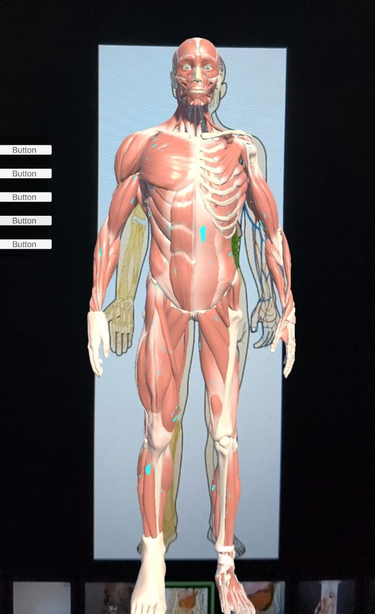
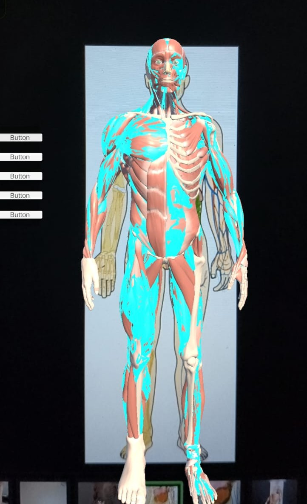

# 🫀 AR Anatomy Project

An augmented reality Android application that overlays a detailed 3D human anatomy model onto a physical image marker, allowing users to explore body systems interactively in real time.

---

## 📱 Demo

> Point your phone at the anatomy image target to see the 3D model appear in AR. Use the on-screen buttons to highlight different body systems.



---

## ✨ Features

- 🔬 **AR Image Tracking** — 3D anatomy model anchored to a physical image marker using Vuforia
- 🫁 **Layer Highlighting** — Tap buttons to highlight individual body systems (Skeleton, Nerves, Veins, Muscles, Skin)
- 🔄 **Model Rotation** — Rotate the 3D model with touch gestures for a full 360° view
- 📐 **Multi-layer Anatomy** — Separate mesh layers for each body system rendered simultaneously
- 📲 **Android Native** — Built and deployed as an APK for Android devices

---

## 🛠️ Tech Stack

| Tool | Purpose |
|------|---------|
| Unity 6 (6000.4.5f1) | Game engine and AR scene management |
| Vuforia Engine 11.4 | Image target tracking and AR Foundation |
| C# | Scripting (highlight system, rotation, UI) |
| Android SDK | Build target platform |
| Universal Render Pipeline (URP) | Rendering and material system |
| TextMesh Pro | UI button text rendering |

---

## 📂 Project Structure

```
AR_Anatomy_Project/
├── Assets/
│   ├── Scripts/
│   │   ├── BodyLayerManager.cs      # Handles layer highlight/reset logic
│   │   ├── HighlightButton.cs       # Button → highlight bridge
│   │   ├── BodyHighlighter.cs       # Body part highlight controller
│   │   ├── RotateModel.cs           # Touch rotation logic
│   │   └── TapDetect.cs             # Tap detection on model
│   ├── Materials/
│   │   └── HighlightMat.mat         # Cyan emission highlight material
│   ├── Scenes/
│   │   └── MainScene.unity          # Main AR scene
│   └── ecorche_-_anatomy_study.glb  # 3D anatomy model (Écorché)
├── Packages/
│   └── manifest.json
└── ProjectSettings/
```

---

## 🚀 Getting Started

### Prerequisites
- Unity 6 (6000.4.5f1)
- Vuforia Engine 11.4 package (download from [Vuforia Developer Portal](https://developer.vuforia.com))
- Android SDK & JDK configured in Unity
- Android device with camera

### Setup

1. Clone the repository:
```bash
git clone https://github.com/Kartikeya2004/AR_Anatomy_Project.git
```

2. Open in Unity Hub → Add project from disk

3. Import Vuforia Engine 11.4 manually:
   - Download `com.ptc.vuforia.engine-11.4.4.tgz` from Vuforia portal
   - Place in `Packages/` folder
   - Unity will auto-import

4. Open `Assets/Scenes/MainScene.unity`

5. Build → Android → Build and Run

### Image Target
Print or display the anatomy image target on screen and point your camera at it to trigger the AR model.

---

## 🎮 How to Use

1. Launch the app on your Android device
2. Point camera at the anatomy image marker
3. The 3D anatomy model will appear anchored to the image
4. Use the **side buttons** to highlight body systems:
   - **Skeleton** — highlights the bone structure
   - **Nerves** — highlights the nervous system
   - **Veins** — highlights the circulatory system
   - **Muscles** — highlights the muscular system
   - **Skin** — highlights the outer skin layer
5. **Swipe** to rotate the model around

---

## 📸 Screenshots

| AR View | Layer Highlighting |
|--------|-------------------|
|  |  |

---

## 🔮 Future Improvements

- [ ] Tap-to-identify individual organs
- [ ] Info panel with anatomy facts per body part
- [ ] Quiz mode for medical students
- [ ] Exploded view animation
- [ ] Voice narration for each body system

---

## 👨‍💻 Developer

**Kartikeya Mishra**
Android & AR Developer
- GitHub: [@Kartikeya2004](https://github.com/Kartikeya2004)

---

## 📄 License

This project is for educational purposes. The 3D anatomy model (Écorché) is sourced from Sketchfab under its respective license.
